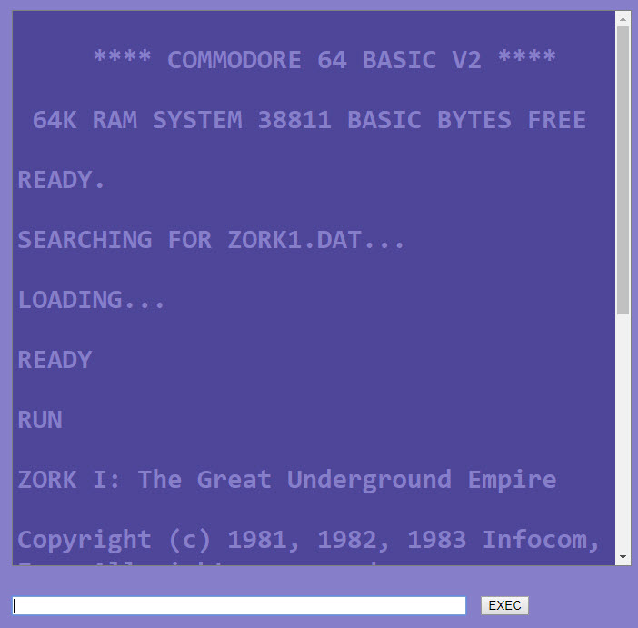

# Z-Machine

This is a Z-machine interpreter in Go.

[Forked](https://github.com/msinilo/zmachine) and ported to WebAssembly.

Read the [original write-up](http://msinilo.pl/blog/?p=1252).

Contact the original author for any licensing questions.  



## Get started

You should have Go installed. As an alternative, you can build from a Docker container.

To build:

`GOOS=js GOARCH=wasm go build -o zmachine.wasm zmachine.go`

**Do not overwrite `wasm_exec.js` as it has been modified to intercept the console output.**

To build with Docker:

`docker run -i --rm -v $(pwd):/usr/src/z -w /usr/src/z -e GOOS=js -e GOARCH=wasm golang:1.12.4 go build -o zmachine.wasm zmachine.go`

Replace `$(pwd)` with `%CD%` on Windows machines. 

Due to copyright issues, this repository does not distribute the game files. If you have legally acquired files (typically in `.DAT` or `.z5` format) you can copy them to the root folder. Edit `games.json` to specify the titles and the names of your game images.

Browser security restricts using `fetch` for local files in most browsers. If you run into this issue, run a lightweight webserver in the root folder. The easiest way for node systems is:

```bash
npm i -g http-server
http-server .
```

The server will display the generated IP addresses and ports, usually [http://localhost:8080](http://localhost:8080).

Enjoy!